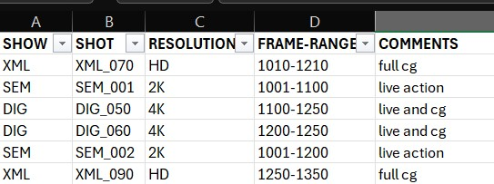

# show-manager
Creates shot list and folder structure. launches nuke houdini etc applications.

## What is a show manager
- **add image**

## What is a project launcher
Description goes here
- **add image**

## How to Use?

1. Clone this repo:
    ```bash
    git clone https://github.com/pratap-gunda/show-manager.git
    ```
2. Get the dependencies:
    ```bash
    pip install -r requirements.txt
    ```
3. Launch the manager:
    ```bash
    python ./show_manager.py
    ```
4. Pick a folder, show, shot, resolution etc.
5. You can also use an excel file with multiple `SHOW`, `SHOT`, `RESOLUTION`, `COMMENTS` columns.
6. Below is the example Excel sheet columns.

4. To launch project launcher:
    ```bash
    python ./project_launcher.py
    ```