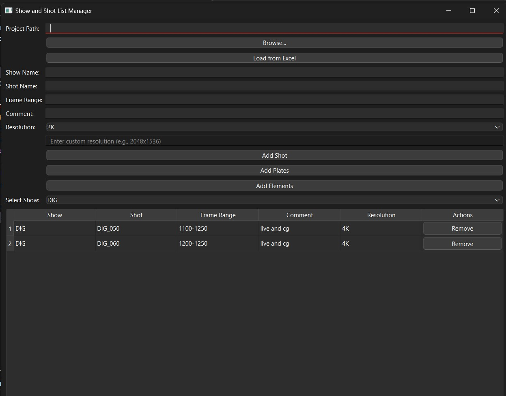
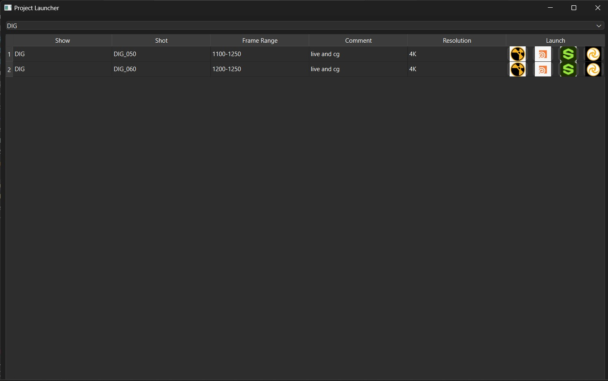

# show-manager
Creates shot list and folder structure. launches nuke houdini etc applications.

## What is a show manager
Show manager is to create and manage shows and shots under that show. We can simply import Excel data to create show and shot list. We can set shot resolution, frame range and comments like what is the task in that shot etc. We can also create folder structure for each shot automatically. All this data we can later use when we work on shots.
- **UI of show manager**


## What is a project launcher
Project launcher is to use the data we added in show manager. we can launch softwares like nuke, houdini, substance with the feeded settings automatically. For eg. it will launch nuke with pre defined settings like resolution frame range and nuke templete to work.
- **UI of project launcher**


## How to Use?

1. Clone this repo:
    ```bash
    git clone https://github.com/pratap-gunda/show-manager.git
    ```
2. Get the dependencies:
    ```bash
    pip install -r requirements.txt
    ```
3. Launch the manager:
    ```bash
    python ./show_manager.py
    ```
4. Pick a folder, show, shot, resolution etc.
5. You can also use an excel file with multiple `SHOW`, `SHOT`, `RESOLUTION`, `COMMENTS` columns.
6. Below is the example Excel sheet columns.

4. To launch project launcher:
    ```bash
    python ./project_launcher.py
    ```